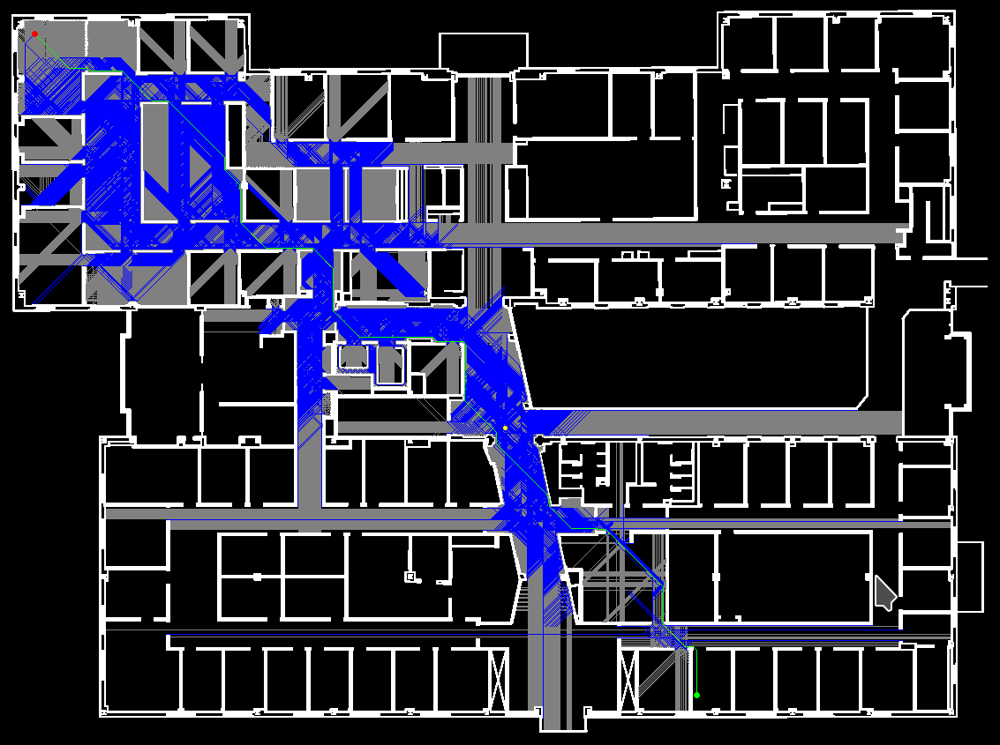

# JumpPointSearch
A* Jump-Point Search

## Build

1. Checkout this repository
    ```
    git clone --recurse-submobules https://github.com/ut-amrl/JumpPointSearch.git
    ```
2. Run `make`

## Run
- Usage: `./bin/jps map.png [goal_x goal y [start x start y]]`  
  Example: `./bin/jps maps/nsh4.png 800 800 50 50`
- To run without the visualization, use the `--nogui` flag.
- To run without junp-point search (pure A*), use the `--nojps` flag.

Example output:

